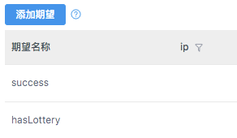

## 参考/资源
- [Yapi官网](https://yapi.ymfe.org/)

## 背景
> 旨在为`开发、产品、测试`人员提供更优雅的接口管理服务。可以帮助开发者轻松`创建、发布、维护` API

## 痛点
### 1. 接口文档维护困难，经常频繁改动，同步不够及时
### 2. 前端很依赖后端数据接口，需要启动服务支持前端开发
### 3. 后端调试成功没有标示和共享快照，前端不知道是否可以联调
### 4. 测试同事要到最后才知道接口开发情况，yapi可提供`测试集合`，方便单独进行`接口测试`

## 方便的迁移，直接在`数据管理`进行导入即可

## yapi工作流
### 接口约定
#### 前后端一起讨论
- 前端从页面直观看到`展示的数据`
- 后端除页面数据外，同时要关注`请求传参`的制定，和`返回参数不同状态`的区分

#### 后续修改后及时同步
- 前端/后端发现接口需要调整的，要互相告知并
- 及时更新到yapi中，避免正式联调的差异
### 前端模拟
- 根据上面步骤，接口约定好了，前端可`自行模拟数据`（一般是正常返回数据，后面可根据情况再补充）

### 后端开发
- 使用`运行`(类似`postman`)功能调试/开发接口

- 调试通过可`保存当前调试配置`

- 将返回的不同参数补充到`高级Mock-添加期望`，供前端调试`不同返回参数`到前端的展示逻辑

### 测试集合
- 上面`后端开发`时，提到过`保存当前调试配置`，可以方便的`切换测试环境`达到接口测试的目的

## 版本管理（相同的接口，在不同的项目）
### 方案1: 使用tag
- 按大项目放置接口
- 每次需求迭代对应的接口，使用tag区分，
- tag筛选过滤查看对应的需求接口
- 缺点：每次要筛选，目前没有支持保存筛选条件
### 方案2: 参考git的分支管理
- 主项目放所有接口（master)
- 每次需求迭代从主项目的json找出对应接口，导入新的项目（featrue)
- 需求完成后利用git合并回主项目
- 缺点：需要手工操作，工作量较大

